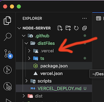

## Установить VERCEL CLI глобально:

```bash
npm i -g vercel
```

## Важно

необходима папка c файлом ./.github/distFiles/.vercel/project.json (для запуска npm run deploy)



## создать файлик:

./.github/distFiles/vercel.json (для запуска npm run deploy)

(для JS уже есть)

```json
{
  "version": 2,
  "builds": [
    {
      "src": "./index.ts",
      "use": "@vercel/node"
    }
  ],
  "routes": [
    { "handle": "filesystem" },
    {
      "src": "/(.*)",
      "dest": "/"
    }
  ]
}
```

</br>

(для TS)

```json
{
  "version": 2,
  "builds": [
    {
      "src": "./dist/index.js",
      "use": "@vercel/node"
    }
  ],
  "routes": [
    { "handle": "filesystem" },
    {
      "src": "/(.*)",
      "dest": "/dist/index.js"
    }
  ]
}
```

<br>

## ДЕПЛОЙ:

```bash
cd dist && vercel --prod

# или:
npm run deploy

# если первый раз:
# set up and deploy [Y/n] y
# pick the account
# link to existing project [Y/n] n
# What's your project's name? your-proj-name
```

# ENV

https://vercel.com/docs/cli/env
