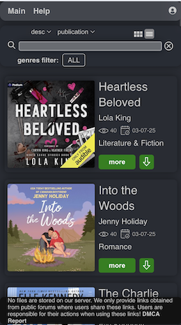
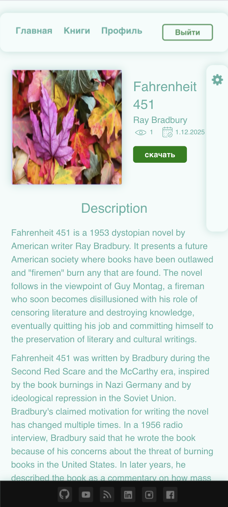
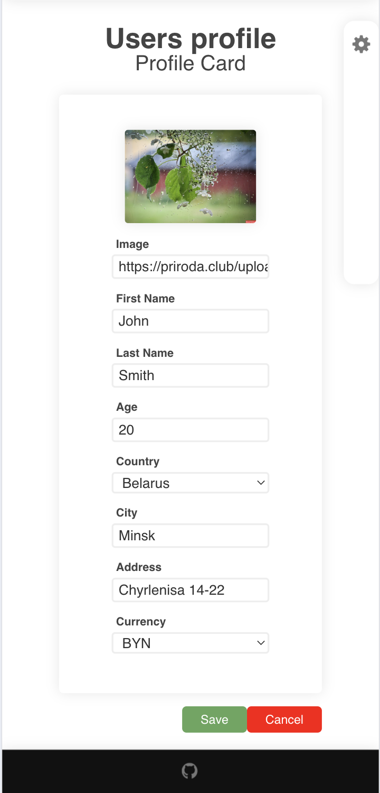
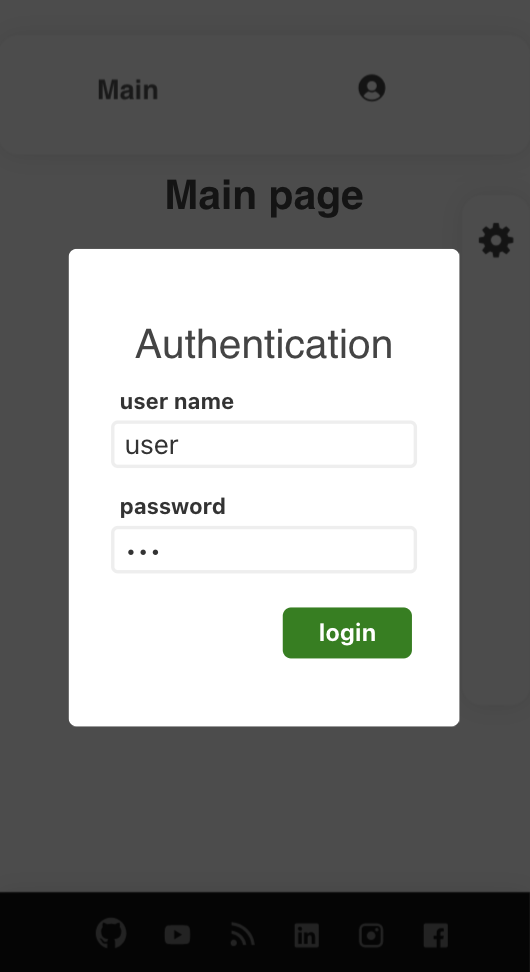
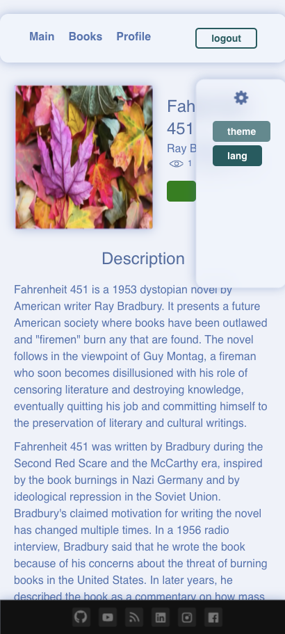

# STORED AUDIO BOOKS

<br><br>

## Пример Опубликован:

https://stored-books.netlify.app/



<br><br>

## доступно в Google:


## проиндексировано несмотря на то, что сделано на React


<br><br><br>

# КРАТКО О ПРИЛОЖЕНИИ:

## Страница доступного списка книг


## о книге подробнее с комментариями



## Страницы профиля пользователя

(только для авторизированных пользователей)



## Basic и JSON Web Token аутентификация



## Различные темы и интернационализация (RU, EN)



<br><br>

# Технологический стек FRONT:

Typescript, React, Redux Toolkit, Thunk (async), Webpack, FSD;
<br>
jest, integration, ui, screenshot tests, ts lint, style lint; Storybook;

# Технологический стек BACK:

Dev: Nodejs json-mock-server (смотри папку mock-server)
<br>
Prod: Java Spring Boot + (H2 | postgresql | mysql...) (смотри sb-lab-api repo)

<br>

# Install APP

### разрабатывалось с node version: v16.14.0

clone the repo then (sudo)

```bash
npm install
```

build storybook: (sudo)

```bash
npm run sb:build
```

в node_modules/entities удалил поля "module" и "exports" и всё заработало

# Запуск App:

```bash
npm start
```

# Запуск Mock-Server:

#### и просматривать его изменения в папке ./mock-server/db.json

```bash
npm run server
```

# Запуск Storybook:

```bash
npm run sb
```

# ТEST:

```bash
npm run lint
npm run stylelint
npm run test
```

# Loki (screenshot test):

### убедиться, что Docker и Storybook запущен и подключен инет

```bash
npm run loki
```

### если всё устраивает:

```bash
npm run loki:ok
```
