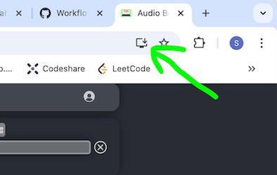

# STORED AUDIO BOOKS

ссылки на аудиокниги на английском языке
<br><br>

## Пример Опубликован:

https://stored-books.netlify.app/


<br><br>

## доступно в Google:


## проиндексировано несмотря на то, что сделано на React


<br><br><br>

# КРАТКО О ПРИЛОЖЕНИИ:

## Есть Progressive Web App (WPA)



## Страница доступного списка книг


## о книге подробнее с комментариями


## Страницы профиля пользователя

(только для авторизированных пользователей)


## Basic и JSON Web Token аутентификация


## Различные темы и интернационализация (RU, EN)


<br><br>

# Технологический стек

## FRONT:

Typescript, React, Thunk (async), RTK query, Webpack, FSD, Redux Toolkit;
<br>
jest, integration, ui, screenshot tests, ts lint, style lint; Storybook;
<br>
CI/CD

## BACK:

Dev: Nodejs json-mock-server (смотри папку mock-server)
<br>
Prod: Java Spring Boot + (H2 | postgresql | mysql...) (смотри sb-lab-api repo)

<br>

# Установка приложения

### разрабатывалось с node version: v16.14.0

clone the repo then (sudo)

```bash
npm install
```

build storybook: (sudo)

```bash
npm run sb:build
```

<!-- в node_modules/entities удалил поля "module" и "exports" и всё заработало -->

# Запуск приложения:

```bash
npm start
```

# Установка и Запуск JSON сервера:

```bash
# clone the repo
git clone --single-branch -b mock-server https://github.com/addamsv/stored-book.git

# install all deps
npm install

# launch the server:
npm start
```

# Запуск Storybook:

```bash
npm run sb
```

# ТEST:

```bash
npm run lint
npm run stylelint
npm run test
```

# Loki (screenshot test):

### убедиться, что Docker и Storybook запущен и подключен инет

```bash
npm run loki
```

### если всё устраивает:

```bash
npm run loki:ok
```
